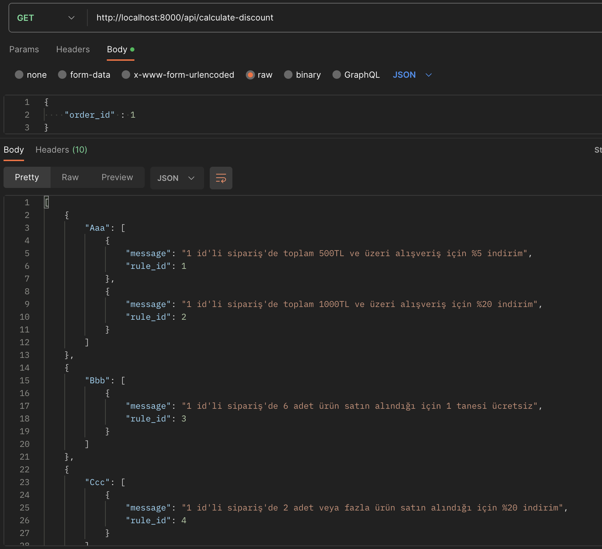

***Ordering application with discount rules***

The discount rules in the application were implemented using the factory method.

The path to the pattern I wrote for the rule is "App\Properties\Discount*."

The configuration file determined for the rule is located at "config\rule-types."

---

You should locate the 'hosts' file on your computer and
add the following lines to it. On Windows systems,
this file can be found in the directory C:\Windows\System32\drivers\etc.

    127.0.0.1 backend.test

---

Let's run Docker by typing the command "docker-compose up --build -d"
in the directory where the docker-compose.yml file is located.

    docker-compose up --build -d

---

You can also check the services from your terminal.
To do this, simply run the command "docker ps".
This will list the services and their status

    docker ps

---

We need to connect to the terminal of the service with the "Container ID"
of the "php73" service among those listed with "docker ps"

For example, let's assume the
Container ID is "39979863cb2b." To connect to the terminal
of this service, you should run the command "docker exec -it 39979863cb2b bash"

    docker exec -it 39979863cb2b bash

(Note: You can also connect by typing the first 3 characters. "docker exec -it 399 bash" will work as well.)

    docker exec -it 399 bash

---

After connecting, you can run
the command "php bin/console doctrine:database:create" to execute
the migrations for the database.

    composer install
    php bin/console doctrine:database:create
    php bin/console doctrine:migrations:migrate
    php bin/console doctrine:fixtures:load

---

**Test Api;**

New Order - Example Request: 

        url: http://backend.test/api/orders
        method: post
        data: {
            "customer_id": 1,
            "items": [
                {
                    "product_id": 4,
                    "quantity": 8
                },
                {
                    "product_id": 1,
                    "quantity": 7
                },
                {
                    "product_id": 3,
                    "quantity": 6
                }
            ]
        }

Calculate Discount - Example Request:

        url: http://backend.test/api/calculate-discount
        method: get
        data: {
            order_id: 1
        }

**DB Designer - Discount Design**

**Order Store - Request - Url: backend.test**

**Calculate Discount - Request - Url: backend.test**

